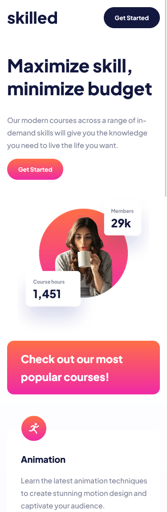

# Frontend Mentor - Skilled e-learning landing page solution

This is my solution to the [Skilled e-learning landing page challenge on Frontend Mentor](https://www.frontendmentor.io/challenges/skilled-elearning-landing-page-S1ObDrZ8q). Frontend Mentor challenges help you improve your coding skills by building realistic projects.

### The challenge

Users should be able to:

- View the optimal layout depending on their device's screen size
- See hover states for interactive elements

### Screenshot

### Links

[Live solution build](https://nabsteur.github.io/skilled-elearning-landing-page/)

### Built with

- Semantic HTML5 markup
- CSS custom properties
- Flexbox